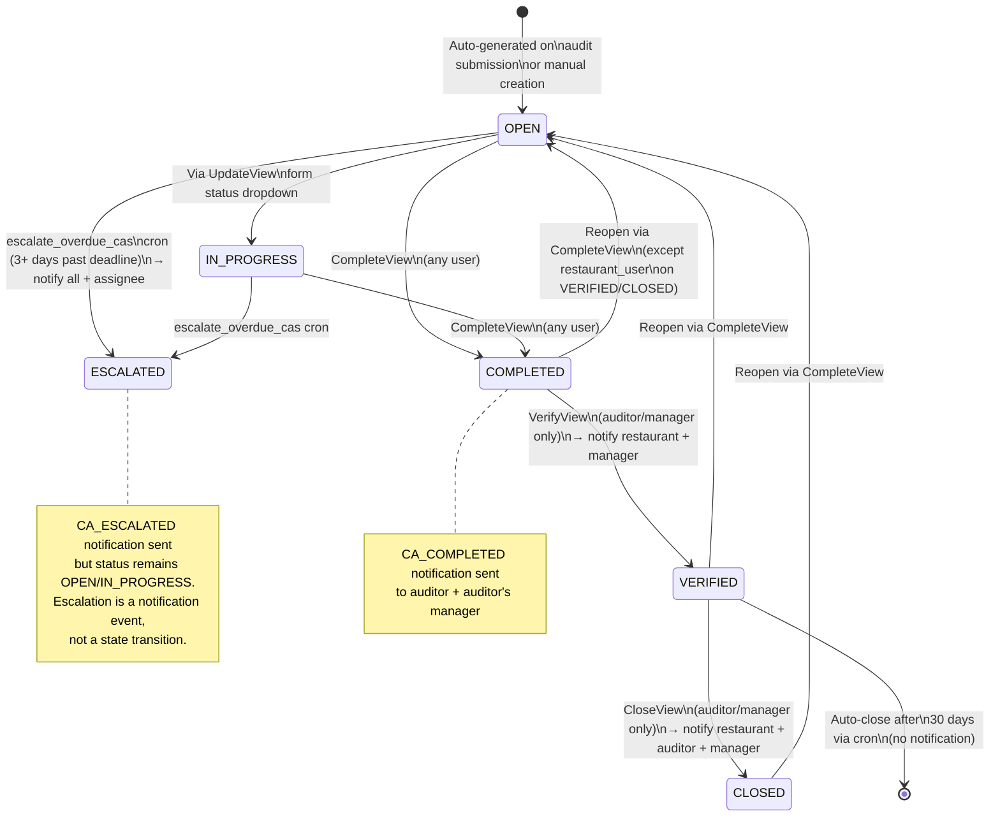
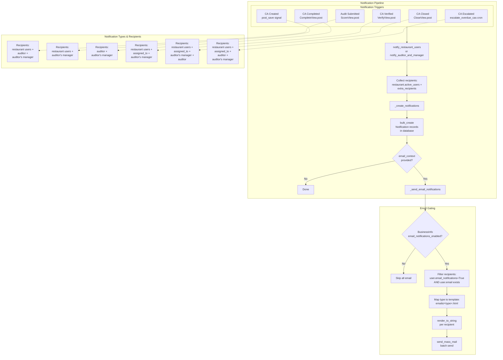
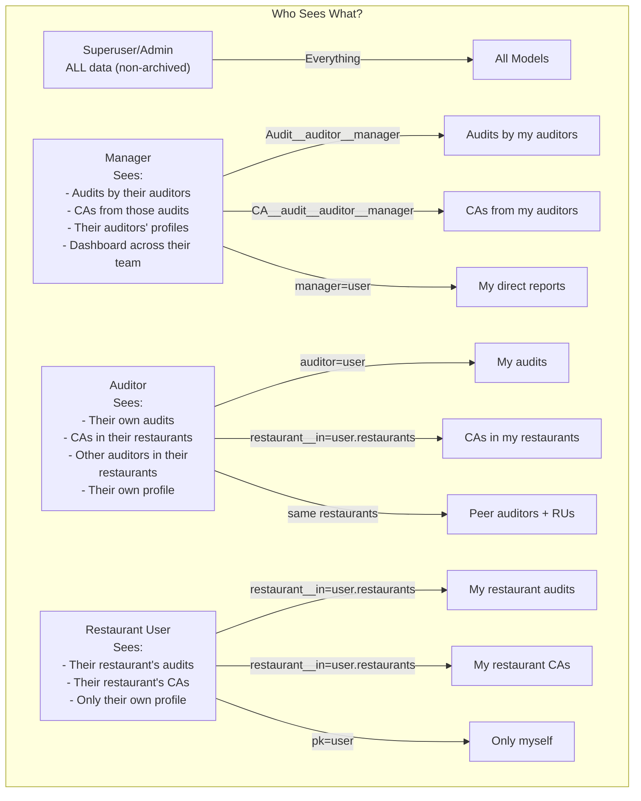
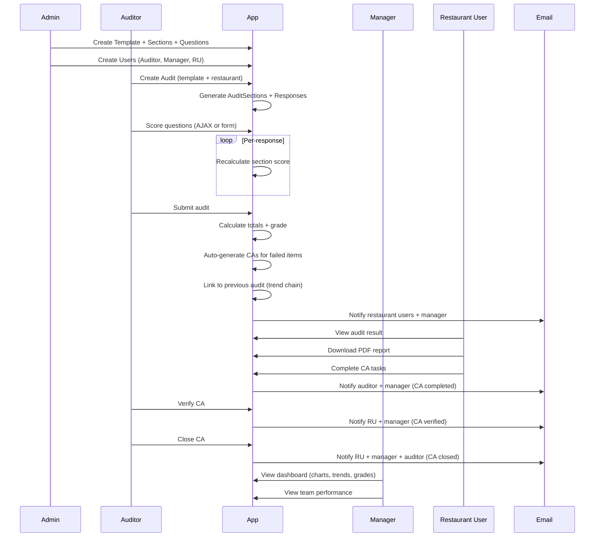

# Complete Workflow Diagram

> View this file in VS Code with the **Mermaid Preview** extension (or GitHub) to see rendered diagrams.

---

## 1. Authentication & User Management Flow

```mermaid
flowchart TD
    subgraph Login["Login Flow"]
        A1[GET /accounts/login/] --> A2[LoginForm rendered\nwith crispy-tailwind]
        A2 --> A3[POST email + password]
        A3 --> A4{rate_limit check\n10 req / 5 min}
        A4 -->|Exceeded| A5[HTTP 429\nToo many requests]
        A4 -->|OK| A6[Authenticate via\nemail + password]
        A6 -->|Invalid| A7[user_login_failed signal\n→ log FAILED_LOGIN_ATTEMPT\n→ re-render form with error]
        A6 -->|Valid| A8[Redirect to /accounts/profile/]
    end

    subgraph PasswordReset["Password Reset Flow"]
        B1[GET /accounts/password_reset/] --> B2{rate_limit\n3 req / 1 hr}
        B2 -->|OK| B3[Enter email]
        B3 --> B4[Django sends\nreset email]
        B4 --> B5[Click link in email]
        B5 --> B6[Enter new password]
        B6 --> B7[Password changed\nredirect to done page]
    end

    subgraph Roles["Role Hierarchy & Permissions"]
        C1["Admin (superuser)\nFull access to everything"] --> C2["Manager\nView auditor audits\nManage CAs\nDashboard analytics"]
        C2 --> C3["Auditor\nCreate/score audits\nManage CAs\nOwn restaurant scope"]
        C3 --> C4["Restaurant User\nView own restaurant audits\nComplete assigned CAs\nNo verify/close"]
    end

    subgraph Admin["User Creation"]
        D1["Django Admin only\n(no self-registration)"] --> D2[UserAdmin with\nImportExport + History]
        D2 --> D3[Set role, designation,\nrestaurants, manager]
        D3 --> D4[sync_role_to_group signal\n→ auto-assigns to Django Group\n→ grants model permissions]
    end
```



---

## 2. Audit Lifecycle

```mermaid
flowchart TD
    subgraph Template["Template Setup (Admin)"]
        T1[Admin creates\nAuditTemplate] --> T2[Add Sections]
        T2 --> T3[Add Questions\nwith possible_points\nand is_critical flag]
    end

    subgraph Create["1. Audit Creation"]
        C1[Auditor navigates\nto /audits/create/] --> C2[AuditForm:\ntemplate, restaurant,\ndate, manager_on_duty,\nauditor]
        C2 --> C3{Validate:\nrestaurant in user.restaurants?\nauditor = self?}
        C3 -->|Valid| C4[transaction.atomic]
        C4 --> C5[Create Audit instance]
        C5 --> C6[_generate_sections:\nfor each Section →\ncreate AuditSection +\nAuditQuestionResponse]
        C6 --> C7[Redirect to\n/audits/&lt;pk&gt;/score/]
    end

    subgraph Score["2. Scoring (3 modes)"]
        S1[AuditScoreView\nGET /audits/&lt;pk&gt;/score/] --> S2[Render sections\nwith formsets + JS]
        S2 --> S3{Scoring mode}

        S3 -->|A: AJAX per-response| A1[SaveResponseView\nPOST /audits/save-response/]
        A1 --> A2[Update single response\nscored_points, is_na, comments]
        A2 --> A3[AuditSection.calculate_section_score\n→ recalculates section % + critical]
        A3 --> A4[Return JSON progress]

        S3 -->|B: Fill remaining| B1[FillRemainingView\nPOST /audits/fill-remaining/]
        B1 --> B2[Set all unanswered\nscored_points = max]
        B2 --> B3[bulk_update + recalculate\nall sections + audit totals]

        S3 -->|C: Full POST submit| C1[POST all formsets]
        C1 --> C2[select_for_update\n(row-lock audit)]
        C2 --> C3[Validate all formsets]
        C3 --> C4[bulk_update all responses\nset is_answered = True]
        C4 --> C5[Recalculate all sections\n→ audit totals + grade]
    end

    subgraph Submit["3. Submission & Notifications"]
        U1[Set is_submitted = True\nsubmitted_at = now] --> U2[link_previous_audit signal:\nfind last audit for same\nrestaurant → link chain]
        U2 --> U3[auto_generate_corrective_actions:\nresponses where needs_ca=True\n→ create CorrectiveAction with\nSLA deadline + risk level]
        U3 --> U4[ca_created_notification signal\n→ notify restaurant users +\nauditor's manager]
        U4 --> U5[Notify restaurant users +\nauditor + manager:\nAudit Submitted]
        U5 --> U6[Redirect to\n/audits/&lt;pk&gt;/result/]
    end

    subgraph Result["4. View Results"]
        R1[AuditResultView\nShow grade, score, sections] --> R2[Download PDF\nAuditReportPdfView\nreportlab → attachment]
        R2 --> R3[Dashboard analytics\nDashboardView:\ntrends, charts, grades,\nCA aging, region scores]
    end

    Create --> Score --> Submit --> Result
    Template --> Create
```

---

## 3. Score Calculation Engine

```mermaid
flowchart LR
    subgraph ResponseLevel["Per-Response"]
        R1[AuditQuestionResponse\nscored_points, is_na] -->|Save/Edit| R2[Clamp scored_points\nto [0, possible_points]]
    end

    subgraph SectionLevel["Per-Section"]
        R2 --> S1[AuditSection.calculate_section_score]
        S1 --> S2[Filter answered,\nnon-NA responses]
        S2 --> S3[possible_points =\nsum question.possible_points]
        S3 --> S4[scored_points =\nsum response.scored_points]
        S4 --> S5[section_percentage =\nscored / possible * 100]
        S5 --> S6[has_critical_failure =\nany critical question\nwith scored_points = 0]
    end

    subgraph AuditLevel["Per-Audit"]
        S6 --> A1[Audit.calculate_totals]
        A1 --> A2[total_scored =\nsum section.scored_points]
        A2 --> A3[total_possible =\nsum section.possible_points]
        A3 --> A4[total_percentage =\nGeneratedField\ncomputed by DB]
        A4 --> A5{has_critical_failure?}
        A5 -->|Yes| G1[Grade = F]
        A5 -->|No| G2{percentage}
        G2 -->|>= 96%| G3[Grade = A]
        G2 -->|>= 90%| G4[Grade = B]
        G2 -->|>= 80%| G5[Grade = C]
        G2 -->|< 80%| G6[Grade = F]
    end

    subgraph Persist["Persistence"]
        G1 --> P1[db_persist update_fields\n→ audit_totals saved]
        G3 --> P1
        G4 --> P1
        G5 --> P1
        G6 --> P1
    end

    ResponseLevel -->|signal: post_save/post_delete\nrecalculate_section| SectionLevel
    SectionLevel -->|signal: post_save\nrecalculate_audit| AuditLevel
```

---

## 4. Corrective Action Lifecycle



### SLA Deadlines by Risk Level

| Risk Level | SLA | Triggered When |
|------------|-----|---------------|
| **CRITICAL** | 3 days | `question.is_critical == True` |
| **HIGH** | 7 days | `scored/possible <= 0.25` |
| **MEDIUM** | 14 days | `scored/possible <= 0.50` |
| **LOW** | 30 days | `scored/possible > 0.50` |

---

## 5. Notification & Email Flow



---

## 6. Data Visibility by Role



---

## 7. End-to-End Flow Summary



---

## 8. File Map

| Path | Role |
|------|------|
| `audits/models.py` | All audit data models & scoring engine |
| `audits/views.py` | 25+ views for audit lifecycle |
| `audits/forms.py` | Forms with validation, scoring, transitions |
| `audits/signals.py` | Auto-recalculation & notifications |
| `audits/utils.py` | CA auto-generation, notification helpers |
| `audits/templatetags/` | Custom template filters |
| `accounts/models.py` | User model with roles & hierarchy |
| `accounts/signals.py` | Role-group sync, M2M validation |
| `accounts/management/commands/setup_groups.py` | Permission definition |
| `core/models.py` | Notification, BusinessInfo |
| `core/security.py` | Rate limiting, suspicious activity |
| `core/email_utils.py` | Email sending wrapper |
| `config/settings/` | 3-tier settings (base/dev/prod) |
